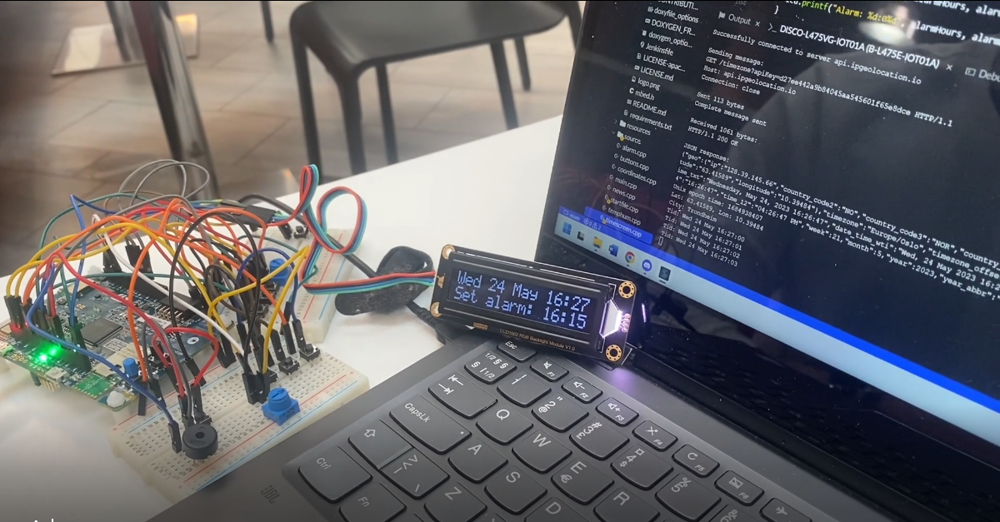

# Microcontroller project
Fully functional microcontroller project 

## Functionality
- ** Functional alarm that starts a beeping sound when activated
- ** Possibility of snoozing the alarm for five minutes
- ** Fetching unix time and transforming to given timezone with time, day and month
- ** Custimizable position, where the user can set latitude and longitude
- ** Displaying weather live for the given position
- ** Displaying city for the given position
- ** Displaying news live

## Screenshot of live demo

